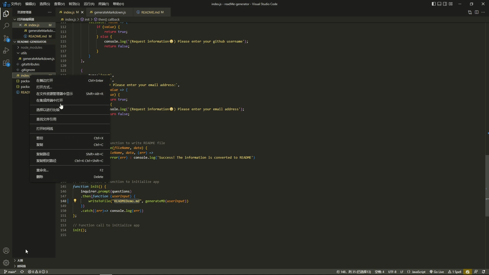

# README Generator
  

  ## Description
  This application is a professional README Generator. Users can create a Readme file by answering questions in their command line using node js.

  ## Table of Contents
  * [Installation](#installation)
  * [Usage](#usage)
  * [License](#license)
  * [Contributing](#contributing)
  * [Tests](#tests)
  * [Questions](#questions)

  ## Installation 
  Users can clone or download the repository. Then install Node, and use the command 'npm i' to install inquirer

  ## Usage 
  Use the command 'node index.js' to start the app. Then answer all the questions.
  
  ## License 
  [MIT](https://choosealicense.com/licenses/mit/)

  ## Contributing 
  N/A

  ## Tests
  npm test

  ## Questions
  Let me know if you need any help from me, you can contact me at jaspercheng2022@gmail.com. For more detail, please visit https://github.com/Hpyorange or https://hpyorange.github.io/JasperWeb/.
